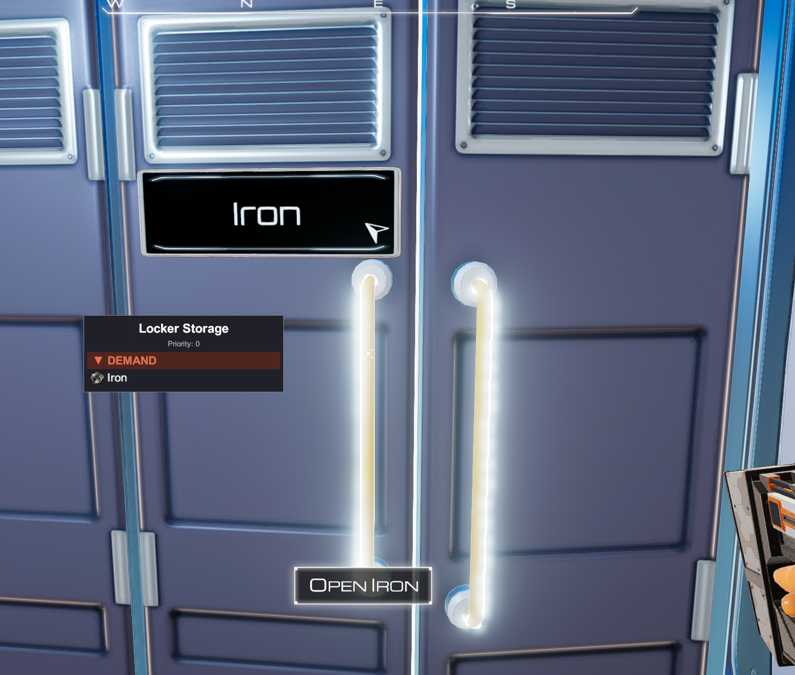

# (UI) Logistics Info

A [BepInEx](https://github.com/BepInEx/BepInEx) mod for **[The Planet Crafter](https://store.steampowered.com/app/1284190/The_Planet_Crafter/)** that adds logistics quality-of-life helpers: a hover panel for container supply/demand details and in-selector counters that show how many containers are already assigned to each resource.

When your crosshair is over a container that participates in logistics (with at least one supply or demand item configured), a small overlay lists **what it supplies**, **what it demands**, and the container’s **priority**. In the logistics resource selector UI, each resource icon also gets a counter badge, plus an indicator for containers supplying **Everything**, to make planning dedicated supply and demand routes easier.



## Requirements

- The Planet Crafter (Steam or compatible install)
- [BepInEx 5](https://github.com/BepInEx/BepInEx) for the game

## Installation

1. Build the project (or use a released `LogisticsInfo.dll`).
2. Copy `LogisticsInfo.dll` into:
   ```
   <Game Folder>\BepInEx\plugins\
   ```
3. Launch the game. A config file is created under `BepInEx\config\` on first run.

## Usage

- **While hovering** a logistics-enabled container, the panel appears (if the mod is enabled and display is on).
- **Toggle display:** hold **Left Ctrl** and press the key set in **Keys → Toggle** (default **L**).
- The panel hides when you look away, open a UI window, or hide the HUD.

## Configuration

Settings are in the BepInEx config file (section names match the table).

| Section | Key | Default | Description |
|--------|-----|---------|-------------|
| **General** | `Enabled` | `true` | Master switch for the mod. |
| **General** | `DebugMode` | `false` | Extra logging to the BepInEx / console log. |
| **Keys** | `Toggle` | `L` | **Primary key** to toggle the overlay. **Always used with Left Ctrl held** (e.g. **Ctrl+L**). You can use a single letter or a full Input System path such as `<Keyboard>/semicolon>`. |
| **UI** | `PanelX` | `-500` | Horizontal offset of the panel from screen center (pixels). |
| **UI** | `PanelY` | `0` | Vertical offset from screen center (pixels). |
| **UI** | `PanelWidth` | `350` | Panel width (pixels). |
| **UI** | `PanelOpacity` | `0.95` | Background opacity (`0` = transparent, `1` = opaque). |
| **UI** | `FontSize` | `20` | Text size. |
| **UI** | `IconSize` | `26` | Item icon size (pixels). |
| **UI** | `RowHeight` | `30` | Height of each item row (pixels). |
| **UI** | `Margin` | `5` | Spacing between UI elements (pixels). |

## Building

1. Point `GameDir` in `LogisticsInfo.csproj` at your game folder if it differs from the default Steam path.
2. Run:
   ```bash
   dotnet build -c Release
   ```
3. Output: `bin/Release/netstandard2.1/LogisticsInfo.dll`

> **Note:** Do not commit `bin/` or `obj/` (they are listed in `.gitignore`). Paths in `LogisticsInfo.csproj` are machine-specific—edit `GameDir` locally, or override it from an untracked [`Directory.Build.props`](https://learn.microsoft.com/visualstudio/msbuild/customize-by-directory) next to the project.

## Changelog

### 1.0.2
- **Resource selector badges:** each resource icon in the supply/demand selector now shows a small counter badge indicating how many containers on the current planet are already supplying or demanding that resource.
- **"Everything" containers excluded from per-item counts** — containers set to supply everything are tallied separately and shown as a label at the bottom of the supply selector dropdown, so badge counts reflect dedicated containers only.
- **"Everything" row in hover panel:** containers supplying everything now show a single compact "Everything" row (with the native supply-all icon) instead of listing all items.

### 1.0.1
- Initial public release: hover panel showing supply, demand, and priority for logistics containers.

## License

This project is licensed under the [MIT License](LICENSE).

## References & credits

This mod was inspired by patterns in **[akarnokd](https://github.com/akarnokd)**’s Planet Crafter mods (e.g. [ThePlanetCrafterMods](https://github.com/akarnokd/ThePlanetCrafterMods) on GitHub): hover handling, Harmony usage, and Unity UI overlay layout similar to **UI Quick Loot** and related examples.

**Personal thanks to [akarnokd](https://github.com/akarnokd)** for help and for maintaining those mods as practical references for Planet Crafter modding.

---

*Not affiliated with Miju Games. The Planet Crafter is a trademark of its respective owners.*
